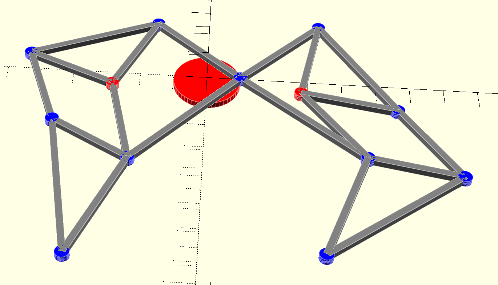
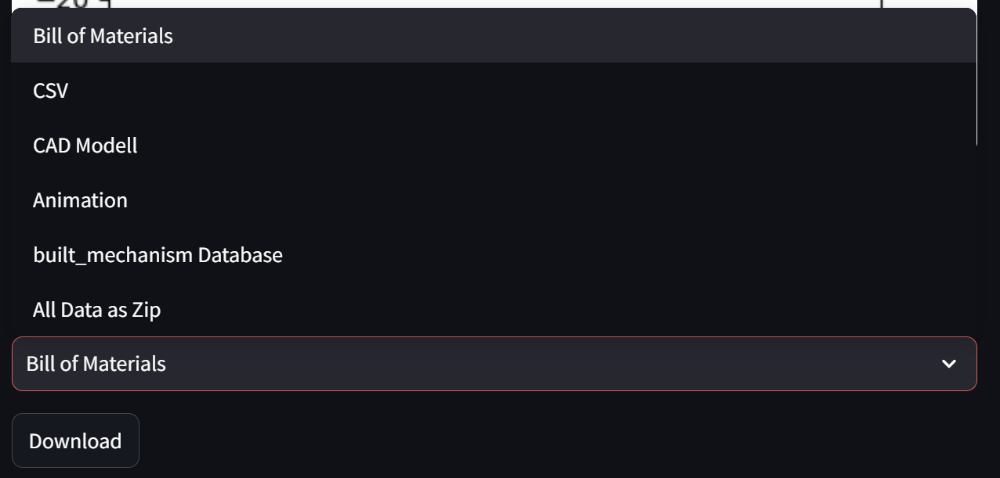

# Simulation ebener Mechanismen

## Einleitung
- **Projektname:** Ebene_Mechanismen
- **Projekttyp:** Simulation
- **Autoren:** Fabian Augschöll, Manuel Hofer
- **Datum:** 27.02.2025
- **Kurzbeschreibung:** Simulation ebener Mechanismen zur Berechnung von Längenfehlern und Visualisierung der kinematischen Bewegung.
- **Mindestzielsetzung:** 
    - Implementierung einer Python-Anwendung mit Streamlit-Web-UI
    - Definition und Simulation ebener Mechanismen
    - Berechnung der Positions-Kinematik für einen Drehwinkelbereich
    - Visualisierung des Mechanismus und seiner Bahnkurven
    - Speicherung und Laden des Mechanismus
    - Fehleroptimierung durch Minimierung der Längenabweichungen
    - Validierung der Mechanismen anhand vorgegebener Testfälle
    - Bereitstellung der Anwendung über Streamlit

## Projektbeschreibung
Dieses Projekt befasst sich mit der Simulation ebener Mechanismen. Die methodische Grundlage zur Berechnung der Längenfehler wurde durch den betreuenden Professor vorgegeben. Anstelle der empfohlenen Matrixrechnung wurde jedoch ein objektorientierter Ansatz gewählt, um eine strukturierte und modulare Implementierung zu gewährleisten. Diese Vorgehensweise erleichtert die Wartung und Erweiterung des Codes, wodurch zukünftige Anpassungen effizienter umgesetzt werden können. Zudem trägt dieser Ansatz zur besseren Lesbarkeit bei und ermöglicht eine klare Trennung der einzelnen funktionalen Komponenten der Simulation.


## Technologien und Werkzeuge
- **Programmiersprache:** Python
- **Web-UI:** Streamlit (für eine interaktive Benutzeroberfläche)
- **Mathematische Bibliotheken:** NumPy, SciPy (für numerische Berechnungen und Optimierung)
- **3D-Modellierung:** OpenSCAD (zur Erstellung eines 3D-Volumenmodells des Mechanismus)


## Installation und Ausführung

1. **Repository klonen:**  
   ```bash
   git clone <repository-url>
   ```
2. **Virtual environemt erstellen:**  
   ```bash
   python -m venv venv
   ```
3. **Abhängigkeiten installieren:**  
   ```bash
   pip install -r requirements.txt
   ```
4. **Projekt starten:**  
   ```bash
   streamlit run ui.py
   ```

## Projektstruktur
```
├── README.md 
├── requirements.txt 
├── doc/  # Dokumentationen und Beispielbilder
├── src/  # Quellcode
```

## UML-Diagramme
- **Aufbau der Klassenstruktur:**
  ```mermaid
    classDiagram
    class dot {
        - _x
        - _y
        - id
        - x_values
        - y_values
        - _instances
        + set_coordinates(x, y)
        + get_coordinates()
        + get_self()
        + get_instances()
        + get_all_instances()
        + clear_instances()
    }

    class fixeddot {
        + to_dict()
        + create_instance()
        + overwrite_all_instances()
        + get_instances()
        + clear_instances()
    }

    class movabledot {
        + to_dict()
        + create_instance()
        + overwrite_all_instances()
        + get_instances()
        + clear_instances()
    }

    class swivel {
        - x_m
        - y_m
        - _r
        - _phi
        + set_phi(phi)
        + to_dict()
        + create_instance()
        + overwrite_all_instances()
        + get_instances()
        + clear_instances()
    }

    class connectionlinks {
        - dot1
        - dot2
        - _instances
        + calc_length()
        + get_instances()
        + create_instance()
        + overwrite_all_instances()
        + get_dot_by_id()
        + clear_instances()
        + to_dict()
    }

    class Database {
        - db
        + save_mechanism(path)
        + load_mechanism(path)
    }

    dot <|-- fixeddot
    dot <|-- movabledot
    dot <|-- swivel
    connectionlinks --> dot : "connects"
    Database --> fixeddot : "manages"
    Database --> movabledot : "manages"
    Database --> swivel : "manages"
    Database --> connectionlinks : "manages"
  ```


- **Aufbau der Berechnungsklasse:**  
  ```mermaid
     classDiagram
    class Calculation {
        - _dots
        - movabledots
        - _connections
        - _fixeddots
        - _swivels
        - _n
        - _m
        + check_dof()
        + calculate(phi, phi2, params, l_c)
        + optimizer(phi, phi2, l_c)
        + trajectory()
        + save_csv(path, id)
        + static_plot()
        + animate_plot(id)
        + create_bom()
    }
  ```


## Proof of Concept: Berechnung
  Die Simulation ebener Mechanismen wurde erfolgreich implementiert und erfüllt die gestellten Minimalanforderungen. Hier gezeigt mit dem Viergelenk bzw. einem Bein des "Strandbeest" von Theo Jansen:
  
  


## Erweiterungen
Bisher wurden folgende Erweiterungen implementiert:
- **Animation als GIF exportieren:**  
  Die Simulation kann als animierte GIF exportiert werden, um Bewegungsabläufe und Fehlerverläufe zu dokumentieren.  
  *siehe [Proof of Concept](#proof-of-concept-berechnung)*
  
- **Stückliste als PDF:**  
  Eine automatische Generierung einer Stückliste im PDF-Format, die alle relevanten Komponenten des Mechanismus (Gestänge, Antriebe, Gelenke) auflistet.  
  *Beispiel anhand vom "two-legged-Strandbeest"*
  
  
- **3D-Volumenmodell mittels OpenSCAD:**  
  Erstellung eines 3D-Modells des Mechanismus, das in OpenSCAD weiterverarbeitet werden kann, um volumetrische Analysen und Visualisierungen zu ermöglichen.  
  *Beispiel anhand vom "two-legged-Strandbeest"*
  


- **Erweiterung auf mehrere Fixpunkte:**
  Die Simulation unterstützt nun mehrere Fixpunkte, um die Bewegung des Mechanismus in verschiedenen Konfigurationen zu analysieren.  
  *Beispiel anhand vom "two-legged-Strandbeest"*
  

- **Einfügen eines Geschwindigkeitsvektors:**
  Der Geschwindigkeitsvektor des gewählten Punktes für die Bahnkuve wird in der Animation visuell dargestellt. Um die Darstellung zu verbessern wurde der Vektor mit dem Faktor 50 multipliziert.   
  *Beispiel anhand vom "Strandbeest"*
  

- **Report**
  Es wird eine Zusammenfassung der Berechnungsergebnisse angezeigt.   
  *Weiteres siehe [Report](#Walkthrough)*

- **Relativer Geschwindigkeitsplot**
  Es wird ein Plot der relativen Geschwindigkeit des gewählten Punktes (bei konstanter Winkelgeschwindigkeit) über die Zeit erstellt.   
  *Weiteres siehe [Report](#Walkthrough)*

- **Fehlerplot**
  Es wird ein Plot des Residual-Error vom Optimierungsvorgang über den Drehwinkel erstellt. Dieser Spiegelt die Längenabweichungen aller Verbindungen wieder.  
  *Weiteres siehe [Report](#Walkthrough)*

- **Auszeichnungssprache mittels JSON-Datenbank**
  Implementierung einer JSON-Datenbank mittels TinyDB zur Speicherung und zum Laden von Mechanismen. Zusätzlich können externe Mechanismen importiert und in der Simulation verwendet werden. Bereits erstellte Mechanismen können heruntergeladen werden. 
  - **Aufbau der Datenbank:**
  ```json
  {
      "fixeddot": {
          "1": {
              "x": 0,
              "y": 0,
              "id": "d0"
          }
      },
      "movabledot": {
          "1": {
              "x": 10,
              "y": 35,
              "id": "d1"
          }
      },
      "swivel": {
          "1": {
              "x_m": -30,
              "y_m": 0,
              "r": 11.180339887498949,
              "phi": 1.1071487177940904,
              "id": "s1"
          }
      },
      "connectionlinks": {
          "1": {
              "dot1": {
                  "x": 0,
                  "y": 0,
                  "id": "d0"
              },
              "dot2": {
                  "x": 10,
                  "y": 35,
                  "id": "d1"
              }
          },
          "2": {
              "dot1": {
                  "x": 10,
                  "y": 35,
                  "id": "d1"
              },
              "dot2": {
                  "x_m": -30,
                  "y_m": 0,
                  "r": 11.180339887498949,
                  "phi": 1.1071487177940904,
                  "id": "s1"
              }
          }
      }
  }
  ```

## Walkthrough
- **Variante A:** Punkte und Verbindungen im Build-Tab händisch erstellen
  - Mechanismus definieren 
  - live-preview wird autoamtisch erstellt 
  - Freiheitsgrade können, müssen aber nicht, händisch überprüft werden 
  
  - der erstellte Mechanismus muss für die Berechnung gespeichert werden (entwerder Temporär oder als eigene Datenbank)
  
  - in den Plot-Tab wechseln und als data source den erstellten Mechanismus auswählen (temporäre Datei bzw. eigene Datenbank)
  
  - Punkt auswählen dessen Bahnkurve zusätzlich zum Bewegungsablauf geplottet werden soll
  - mit *calculate* die Berechnung starten (Berechnung und erstellen der Simulation kann einige Sekunden dauern)
  - im Download-Bereich unter der Visulaisierung können alle erstellen Dateien (Stückliste, CSV-Bahnkurve, CAD-Modell, Animation, Datenbank, Bahnkurve als png) heruntergeladen werden
  	

- **Variante B:** Mechanismus importieren
  - plot-Tab öffnen
  - bei der Auswahl der data source eine vorhandene Datenbank auswählen bzw. über den Upload eigene hochladen
  
  - Punkt auswählen dessen Bahnkurve zusätzlich zum Bewegungsablauf geplottet werden soll
  - mit *calculate* die Berechnung starten (Berechnung und erstellen der Simulation kann einige Sekunden dauern)
  - im Download-Bereich unter der Visulaisierung können alle erstellen Dateien (Stückliste, CSV-Bahnkurve, CAD-Modell, Animation, Datenbank, Bahnkurve als png) heruntergeladen werden
  

- **Report-Tab**
  - Im Report-Tab befindet sich eine kurze Zusammenfassung des Mechanismus. Dort werden alle wichtigen Punkte und Verbindungen zusammengefasst sowie der berechnete Freiheitsgrad, die Längenfehler und die Bahnkurve des ausgewählten Punktes dargestellt.
    - Der Fehlerplot zeigt die Längenabweichungen der Verbindungen in Abhängigkeit vom Drehwinkel.
    
    - Die Bahnkurve veranschaulicht die Bewegung des ausgewählten Punktes über den gesamten Drehwinkelbereich.
    


## Weiterführende Informationen
- **Quellen**
  - [Streamlit](https://docs.streamlit.io) (UI)
  - [SciPy-Optimize](https://docs.scipy.org/doc/scipy/reference/optimize.html) (Optimierung)
  - [OpenSCAD](https://en.wikibooks.org/wiki/OpenSCAD_User_Manual) (CAD)
  - [TinyDB](https://tinydb.readthedocs.io/en/latest/) (Datenbank)
  - [Strandbeest](https://de.wikipedia.org/wiki/Strandbeest) (Projektbeispiel)
- **Tools**
  - [KI](https://copilot.github.com)    (Kommentare und Debugging)   


